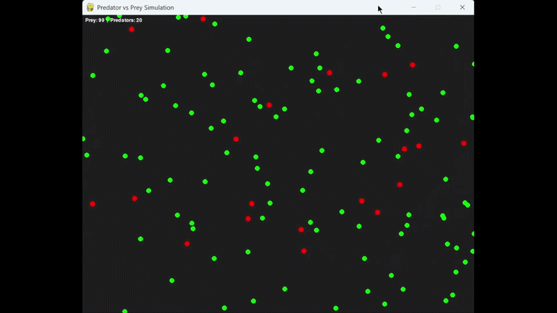

# Predator–Prey Co-Evolution using NEAT

This project is a real-time simulation where predator and prey agents evolve behaviour over time using NeuroEvolution of Augmenting Topologies (NEAT). The goal is to explore how simple rules and co-evolution can produce emergent behaviour.

## Overview

Two species are simulated in a 2D environment:

* Predators must hunt prey to survive and reproduce
* Prey must avoid predators and survive long enough to reproduce

Both species are controlled by neural networks that evolve over time through mutation.

The project compares two evolutionary scenarios:

* **Red Queen**: a stable environment where adaptation is driven by competition
* **Court Jester**: an unstable environment with periodic disruptions

## Features

* Co-evolving predator and prey populations
* Neural networks evolved using NEAT (topology and weights)
* Ray-based sensing system for agent perception
* Real-time simulation using Pygame
* Tracking of population size, fitness, and network complexity

## Emergent Behaviour

The simulation produces observable behaviours without being explicitly programmed:

* Predators develop chasing behaviour
* Prey adopt circular motion and form clusters
* Population cycles emerge based on predator–prey interactions

## Running the Project

### Install dependencies

pip install -r requirements.txt

### Run the simulation

python main.py

## Controls

* Press SPACE to toggle ray visualisation
* Close the window to end the simulation

## Project Structure

* main.py – entry point
* Simulation.py – main loop and setup
* World.py – manages populations and interactions
* Entity.py – base class for all agents
* Predator.py – predator behaviour and logic
* Prey.py – prey behaviour and logic
* configs/ – NEAT configuration files

## Technologies

* Python
* Pygame
* NEAT-Python
* NumPy / Matplotlib
